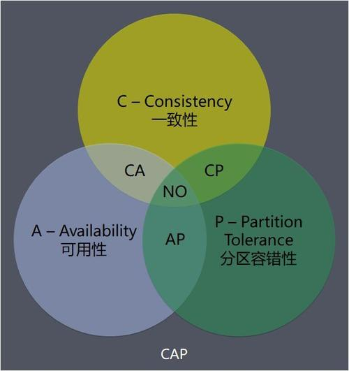

# spring-cloud 全家桶示例

- [x] 一、Rest微服务构建案例工程模块

- [x] 1.微服务提供者module( case-provider-dept-8001 )

- [x] 2.微服务消费者module( case-consumer-dept-80 )

- [x] 二、Eureka服务注册与发现

1. Eureka是Netflix的一个子模块，也是核心模块之一。Eureka是一个基于REST的服务，用于定位服务，以实现云端中间层服务发现和故障转移。服务注册与发现对于微服务架构来说是非常重要的，有了服务发现与注册，只需要使用服务的标识符，就可以访问到服务，而不需要修改服务调用的配置文件了。功能类似于dubbo的注册中心，比如Zookeeper。

2. Eureka遵守AP原则；CAP原则又称CAP定理，指的是在一个分布式系统中，Consistency（一致性）、 Availability（可用性）、Partition tolerance（分区容错性），三者不可兼得

3. Eureka包含两个组件：Eureka Server和Eureka Client

- Eureka Server提供服务注册服务
各个节点启动后，会在EurekaServer中进行注册，这样EurekaServer中的服务注册表中将会存储所有可用服务节点的信息，服务节点的信息可以在界面中直观的看到

- EurekaClient是一个Java客户端，用于简化Eureka Server的交互，客户端同时也具备一个内置的、使用轮询(round-robin)负载算法的负载均衡器。在应用启动后，将会向Eureka Server发送心跳(默认周期为30秒)。如果Eureka Server在多个心跳周期内没有接收到某个节点的心跳，EurekaServer将会从服务注册表中把这个服务节点移除（默认90秒）

4. 功能类似dubbo的zookeeper

> Eureka 满足AP原则；Zookeeper 满足CP原则
>

- [x] 三、Ribbon负载均衡

客户端的负载均衡

- [x] 四、Feign负载均衡

声明式Web服务客户端，面向接口编程；自带ribbon负载算法

- [x] 五、Hystrix断路器

1、服务熔断：熔断机制是应对雪崩效应的一种微服务链路保护机制。
当扇出链路的某个微服务不可用或者响应时间太长时，会进行服务的降级，进而熔断该节点微服务的调用，快速返回"错误"的响应信息。当检测到该节点微服务调用响应正常后恢复调用链路。在SpringCloud框架里熔断机制通过Hystrix实现。Hystrix会监控微服务间调用的状况，当失败的调用到一定阈值，缺省是5秒内20次调用失败就会启动熔断机制。熔断机制的注解是@HystrixCommand

2、服务降级：整体资源快不够了，忍痛将某些服务先关掉，待渡过难关，再开启回来。
服务的降级是在客户端完成实现的，和服务端没有关系

3、服务监控hystrixDashboard

- [x] 六、Zuul路由网关

> 路由、过滤

- [x] 七、SpringCloud Config

服务端和客户端

